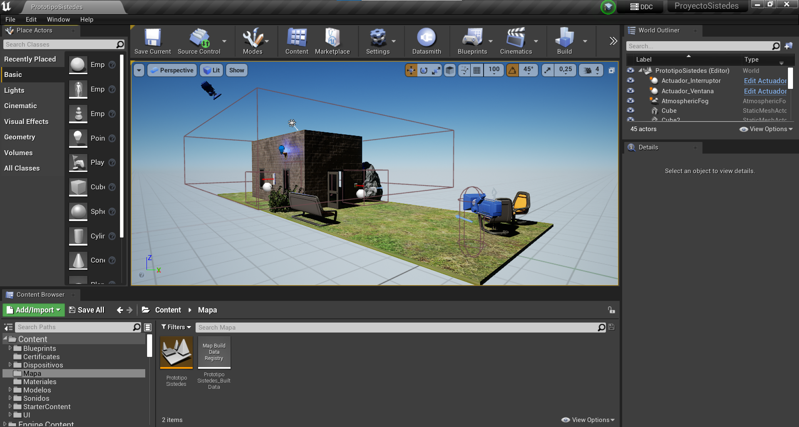
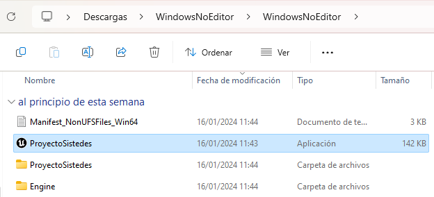

# PrototipoDT-Sistedes
Prototipo en Unreal Engine 4.27 desarrollado para el diseño de edificios inteligentes con dispositivos IoT. El principal objetivo consiste en aportar una mayor información sobre los dispositivos y su relación con el entorno con la simulación en un entorno virtual. Este proyecto incluye las siguientes características:

- Definición de un pequeño edificio con sus dispositivos IoT.
- Navegación en un entorno 3D con una vista de órbita o vista en primera persona.
- Conjunto de  dispositivos interacuables con el usuario que ofrecen información sobre la temperatura, la humedad o el viento entre otros datos.
- Conexión con API para obtener datos actualizados en los dispositivos, adaptando la simulación a su información.
- Posibilidad de ver la relación existente entre los distintos dispositivos o como afectan a su entorno.

## Requisitos del Sistema

Para ejecutar el código y comprobar su funcionamiento en Unreal será necesario instalar lo siguiente:

- Unreal Engine 4.27
- Git

## Configuración del Proyecto

1. **Clonar el Repositorio:**
```
git clone https://github.com/acgtic211/PrototipoDT.git
```
2. **Instalar Dependencias:**
Será necesario incluir entre los plugins de Unreal utilizados VaRest. [https://www.unrealengine.com/marketplace/en-US/product/varest-plugin]

3. **Compilar y Ejecutar:**
- Abre el proyecto en Unreal Engine.
- Compila el proyecto y ejecútalo.



## Ejecutable compilado

Si no se desea usar Unreal Engine para ver el proyecto, se puede acceder a [https://github.com/acgtic211/PrototipoDT/releases/tag/Prototipo].Para ejecutar el proyecto será necesario descomprimir el archivo y ejecutar el archivo ProyectoSistedes.



## Uso del Proyecto

1. **Navegar en el Entorno:**
- El usuario comenzará en la vista de primera persona. Las teclas WASD permiten el movimiento por el entorno, mientras que el ratón será el responable de mover la hora.
- Al pulsar la tecla L el usuario entrará en el modo mirar, apareciendo el cursor del ratón y permitiendo interactuar con los elementos de la interfaz.
- El usuario también puede cambiar a la vista orbital seleccionando la opción correspondiente. Podrá manejar la cámara con el ratón, ademáss de aumentar o disminuir el zoom con la rueda del ratón. En este vista se pueden ocultar y desocultar los muros con la tecla E.

2. **Interactuar y Visualizar datos de dispositivos IoT:**
- Si el usuario se encuentra a una distancia adecuada se presentarán los dispositivos cercanos. Si el usuario se acerca lo suficiente al dispositivo podrá interactuar con este y ver sus dispositivos relacionados con las teclas F y R respectivamente.
- En el supuesto de las ventanas, también permitirá ajustar sus persianas con las teclas T y G.
- También se puede interactuar con los dispositivos a través de su interfaz, haciendo clic con el ratón en sus iconos o botones de "Relacionados".
- Se distingue entre sensores (identificados con un color amarillo) y actuadores (caracterizados por un color rosado). Los sensores presentan información, mientras que los actuadores afectan a su entorno.

